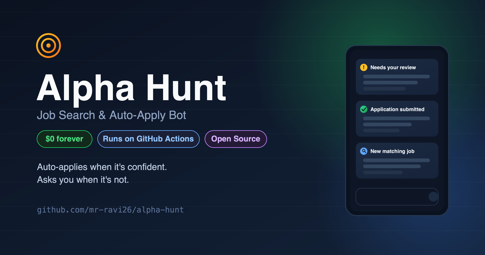
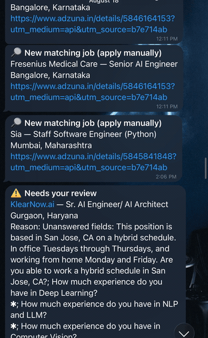
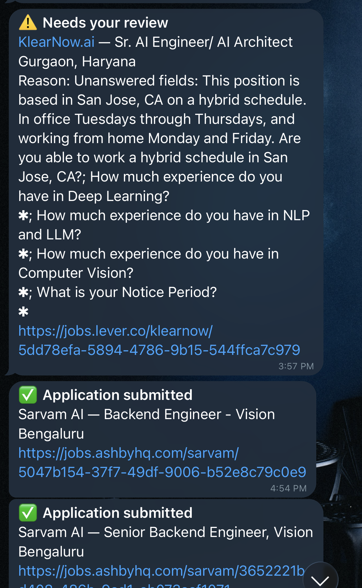
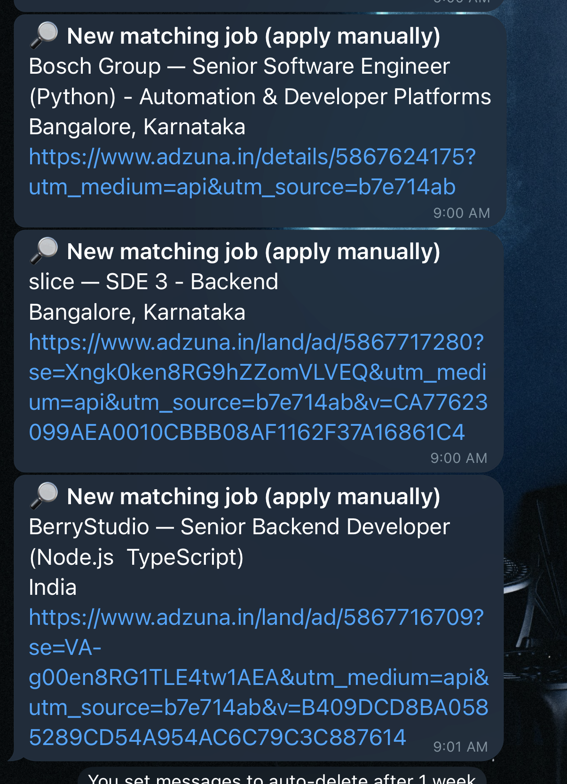

# 🎯 Alpha Hunt — Job Search & Auto-Apply Bot

[](LICENSE)
[](requirements.txt)
[](CONTRIBUTING.md)
[](https://github.com/mr-ravi26/alpha-hunt/stargazers)
[](#quickstart)
[](https://www.paypal.com/ncp/payment/W8SPJFJ24J2TN)

Automatically checks tracked companies' career pages every 15 minutes,
auto-applies to matching roles, and pings you on Telegram. It also runs a
broader keyword search across the wider job market and notifies you
(without auto-applying) since those postings go to unpredictable forms.

**$0 to run, forever.** No paid API keys, no server to host, no subscription.
It runs entirely on free GitHub Actions — the only credentials involved are
a free Telegram bot token (2-minute setup via `@BotFather`) and an optional
free-tier Adzuna key for the broad-search lane.

Unlike most "auto-apply" tools, it only submits when every required field
can be answered with confidence; anything ambiguous gets routed to you
instead of guessed, so it won't quietly submit garbage on your behalf.

## What it does

- **Company ATS lane (Greenhouse / Lever / Ashby)** — fetches new postings,
  fills the application form, and submits automatically **only if every
  required field could be confidently answered**. If something's
  ambiguous, it skips submitting and pings you to finish it by hand
  instead of guessing.
- **Broad search lane (Adzuna)** — notifies you of new matches across a
  much wider set of companies/boards, for you to apply manually.

## Demo



Real Telegram notifications from a running instance:

| Auto-applied + needs review | Broad search matches |
| :---: | :---: |
|  |  |

## Quickstart

1. Fork this repo → push to a **private** repo of your own (see the note below on why)
2. Fill in `config.yaml` (search terms + your details) and `qa.yaml` (copy from `qa_template.yaml`)
3. Create a Telegram bot, add its token + your chat ID as GitHub secrets
4. Push — the included Actions workflow starts running every 15 minutes automatically

Full walkthrough in [Setup](#setup) below.

## Setup

### 1. Fork/clone and fill in your details

- Copy your resume to `data/resume.pdf`
- Edit `config.yaml`:
  - `keywords`, `locations`, `exclude_keywords`
  - `companies` — add real companies with their ATS + `board_token` (see
    the comments in the file for how to find these)
  - `applicant` — your name, email, phone, LinkedIn, resume path
- Copy `qa_template.yaml` to `qa.yaml` and fill in your real answers
  (both `config.yaml` with real values and `qa.yaml` are gitignored by
  default — see [.gitignore](.gitignore) — so they won't be committed to
  this repo's history by accident)

### 2. Create a Telegram bot

1. Message `@BotFather` on Telegram → `/newbot` → follow prompts → copy the token.
2. Send any message to your new bot.
3. Visit `https://api.telegram.org/bot<TOKEN>/getUpdates` in a browser to find your `chat_id`.

### 3. (Optional) Get a free Adzuna API key

For the broad-search lane: sign up free at https://developer.adzuna.com/
and grab your `app_id` and `app_key`.

### 4. Push to a **private** GitHub repo

> **Why private:** once you fill in `config.yaml` with your real details and
> add your resume to `data/`, that copy contains personal information
> (name, email, phone, resume) that gets committed so the scheduled
> GitHub Actions run can read it. Never push your filled-in copy to a
> public repo. (This public template repo itself only ships
> placeholder/example values — see [.gitignore](.gitignore).)

```bash
git init
git add .
git commit -m "Initial job bot setup"
git remote add origin <your-private-repo-url>
git push -u origin main
```

### 5. Add secrets

In your GitHub repo → Settings → Secrets and variables → Actions, add:

- `TELEGRAM_BOT_TOKEN`
- `TELEGRAM_CHAT_ID`
- `ADZUNA_APP_ID` (optional)
- `ADZUNA_APP_KEY` (optional)

### 6. Done

The workflow in [`.github/workflows/job-search.yml`](.github/workflows/job-search.yml)
runs automatically every 15 minutes. You can also trigger it manually from
the Actions tab ("Run workflow").

## Good to know

- LinkedIn and Indeed are **intentionally not auto-applied to** — their
  terms of service prohibit automated applications and doing so risks your
  account being banned. Use their native "job alert" notifications for
  those platforms instead, and apply manually or with browser-assist.
- Auto-filled forms are only as good as the `qa.yaml` answers you provide.
  Review the first several "submitted" notifications closely to make sure
  answers look right, and expand `qa.yaml` as you see new recurring
  questions in the "needs review" alerts.
- Company career page HTML changes over time — expect to revisit `apply.py`
  occasionally if a particular company's form stops filling correctly.

## Controlling volume

If you're getting too many alerts, tune these in `config.yaml`:

- **`exclude_keywords`** — add seniority levels or roles you don't want (already pre-filled with common ones like "Staff", "Director", "Lead").
- **`must_include_all`** — e.g. `["Backend"]` forces every match to contain that word too, on top of the normal keyword-OR match. Good for sharpening an overly broad keyword list.
- **`broad_search.max_days_old`** — only show broad-search jobs posted in the last N days (filters out stale aggregator listings).
- **`broad_search.salary_min`** — filters out low-paying noise (uses annual amount in your `adzuna_country`'s currency).
- **`settings.max_broad_notifications_per_run`** and **`max_broad_notifications_per_day`** — hard caps on how many notify-only Telegram pings you get, regardless of how many jobs matched. Extras are marked as seen (so you won't be re-spammed with them later) but simply aren't sent.
- **`settings.max_applications_per_run`** — hard cap on auto-submitted applications per run, as a safety brake.

The company auto-apply lane isn't capped by these — it only ever sends what genuinely matches your tracked companies, which should stay naturally low volume.

## Running locally (to test before deploying)

```bash
pip install -r requirements.txt
playwright install --with-deps chromium
export TELEGRAM_BOT_TOKEN=xxx
export TELEGRAM_CHAT_ID=xxx
python src/main.py
```

## Project layout

```
config.yaml           - search settings, companies, applicant info (real copy: gitignored)
qa_template.yaml       - copy to qa.yaml, fill with your real answers (qa.yaml: gitignored)
data/resume.pdf         - your resume (add this yourself, gitignored)
data/seen_jobs.json    - auto-generated, tracks what's already been handled
data/daily_counts.json - auto-generated, tracks daily notification counts
src/sources.py         - fetches jobs from Greenhouse/Lever/Ashby/Adzuna
src/apply.py           - fills and submits ATS application forms
src/state.py           - filtering + dedupe logic + daily notification caps
src/notify.py          - Telegram messaging
src/main.py            - orchestrator, run this
.github/workflows/     - the schedule that runs it every 15 minutes
```

## Contributing

Bug reports, feature ideas, and PRs are welcome — see
[CONTRIBUTING.md](CONTRIBUTING.md) for setup and guidelines.

## Support this project

If Alpha Hunt landed you fewer hours of manual form-filling, consider
buying me a coffee ☕ — it helps keep this maintained and free for everyone.

[](https://www.paypal.com/ncp/payment/W8SPJFJ24J2TN)

## License

[MIT](LICENSE) — free to use, modify, and self-host.
